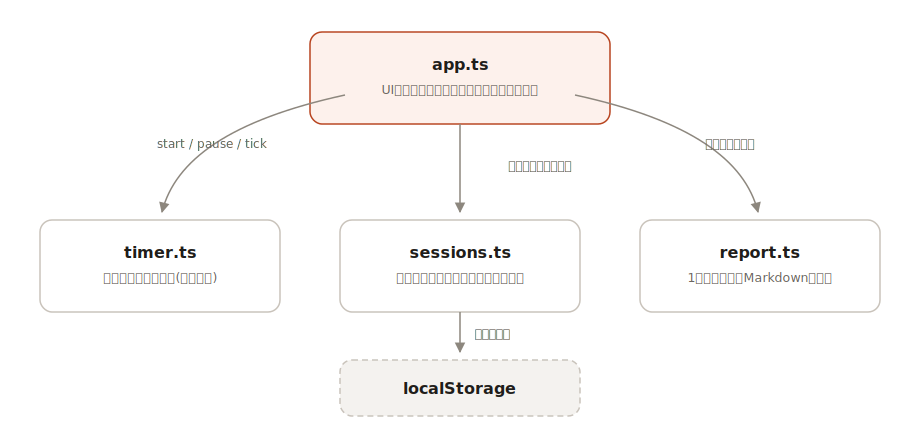

# mokumoku

[](https://github.com/miruky/mokumoku/actions/workflows/ci.yml)
[](https://github.com/miruky/mokumoku/actions/workflows/deploy.yml)
[](https://www.typescriptlang.org/)
[](https://vitest.dev/)
[](https://opensource.org/licenses/MIT)

**黙々と積んだ25分が、そのまま日報になる。ポモドーロタイマーと作業ログを1枚にまとめたツール。**

## 概要

「いまの作業」を書いてタイマーを回すと、完了した集中セッションが自動で今日のログに積まれていきます。25分集中・5分休憩・4本ごとに長休憩というポモドーロの周期を進捗リングと残り時間で表示し、フェーズの満了は短いチャイムとタブタイトルで知らせます。1日の終わりに「日報を生成」を押せば、本数・合計時間・作業別の内訳・タイムラインを組み立てたMarkdownができあがり、コピーするかファイルとして保存できます。

記録はすべてこの端末のlocalStorageに保存されます。アカウントも通信もありません。

試す: https://miruky.github.io/mokumoku/

### なぜ作ったのか

ポモドーロタイマーはいくらでもありますが、回した結果は「今日は何本やった」という数字で消えていきます。一方で日報を書く段になると、何にどれだけ時間を使ったか思い出せません。タイマーが知っているはずの情報を、タイマーに記録させてそのまま日報の形で取り出す。やることはそれだけに絞りました。

## アーキテクチャ



中心は3つの純粋なモジュールです。`timer.ts` はポモドーロの状態機械で、現在時刻を常に引数で受け取るためテストで時間を自由に動かせます。`sessions.ts` は完了した集中セッションの台帳で、検証つきの直列化と作業別の集計を持ちます。`report.ts` は1日分のセッションから日報Markdownを組み立てる文字列生成器です。DOMに触るのは `app.ts` だけで、25分の満了を検知したら台帳に1行書き、日報ボタンで今日の分を `report.ts` に渡します。

## 技術スタック

| カテゴリ | 技術                    |
| :------- | :---------------------- |
| 言語     | TypeScript 5(strict)    |
| 通知音   | Web Audio API(自前生成) |
| ビルド   | Vite 6                  |
| テスト   | Vitest(35テスト)        |
| リンタ   | ESLint + Prettier       |
| CI / CD  | GitHub Actions          |
| 配信     | GitHub Pages            |

## 使い方

- 「いまの作業」に作業名を入れて「開始」。空のまま回すと「(名称未設定)」として記録されます
- 25分経つとチャイムが鳴り、セッションがログに載って小休憩に移ります。休憩も「開始」で回します
- 「スキップ」は現在のフェーズを打ち切って次へ進めます。集中中なら、1分以上経過していれば中断として記録されます(1分未満は捨てます)
- 4本の集中ごとに長休憩が入ります。リングの横の点が長休憩までの進みです
- 「日報を生成」で今日のログがMarkdownになります。コピーまたは `nippou-YYYY-MM-DD.md` としてダウンロードできます
- 「時間の設定」で集中・休憩の長さと長休憩の間隔を変えられます。進行中のフェーズは打ち切らず、次のフェーズから反映されます

制約も書いておきます。タイマーは満了時刻ベースなのでバックグラウンドタブでも狂いませんが、チャイムは鳴るのが遅れることがあります。一時停止した時間はログの時間帯に含まれるため、長く停めたセッションは実際の集中時間より長く見えます。記録は端末の中だけにあり、ブラウザのサイトデータを消すと一緒に消えます。

## プロジェクト構成

- `src/lib/timer.ts` — ポモドーロの状態機械。開始・一時停止・満了判定・サイクル管理
- `src/lib/sessions.ts` — 集中セッションの台帳。検証・直列化・作業別集計
- `src/lib/report.ts` — 1日分のセッションから日報Markdownを生成
- `src/app.ts` — ダイヤル・ログ・日報ダイアログのUI
- `docs/architecture.svg` — アーキテクチャ図

## はじめ方

### 前提条件

- Node.js 20 以上

### セットアップ

```bash
git clone https://github.com/miruky/mokumoku.git
cd mokumoku
npm ci
npm run dev
```

### テストとlint

```bash
npm test
npm run lint
```

### ビルド

```bash
npm run build
```

GitHub Pagesで配信する場合は、`MOKUMOKU_BASE=/mokumoku/` を環境変数に渡してサブパス配信用のベースを切り替えます。`main` へのpushで `deploy.yml` が同じ手順を実行します。

## 設計方針

- **時刻は引数で渡す** — `timer.ts` はDateを直接読まず、現在時刻を常に引数で受け取ります。満了判定やサイクルの巻き戻りといった時間まわりのロジックを、実時間を待たずにテストできます。
- **記録は完了したものだけ** — 開始しただけのセッションは台帳に入れません。満了か、1分以上経過した中断だけを記録するので、ログがそのまま日報の材料になります。
- **日報は純粋な文字列生成** — `report.ts` はセッション配列を受け取ってMarkdownを返すだけの関数です。集計順(合計時間の降順)やタイムラインの形式はテストで固定しています。
- **ローカルファースト** — 保存先はlocalStorageのみで、壊れた保存値は読み飛ばして起動します。サーバーを持たないので、GitHub Pagesの静的配信だけで完結します。

## ライセンス

[MIT](LICENSE)
